# Board Game & Film Club

RepX Gym is a modern, responsive fitness website designed to showcase membership options, gym equipment, contact information, and opening hours. It provides a clean, professional user experience that makes it easy for potential members to learn about the gym and join.  

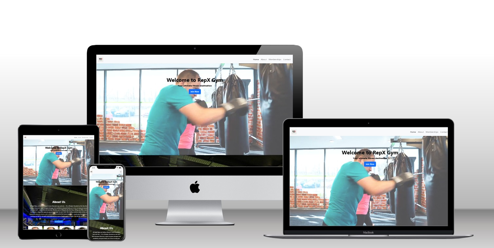

Source: [Techsini Multi Device Website Mockup Generator](http://techsini.com/multi-mockup/?url=https://apeskinian.github.io/p1_bgfc/)

## UX

The strategy was to create an **easy-to-navigate, visually engaging gym website**. It should:  

- Attract new members with clear membership plans.  
- Showcase available gym equipment to inspire confidence and know what they expect .  
- Provide practical info (location, opening hours, contact details).  
- Allow users to submit forms with their membership plans. 

### Colour Scheme

- `#0b089e` – Primary background (hero + membership section)  
- `#ffffff` – Main text + background for cards  
- `#000000` – Logo and key typography  
- Accent: Red (`#ff0000`) for **X** in logo 

## User Stories

### New Users  
- As a visitor, I want to quickly see membership options, so I can choose a plan.  
- As a visitor, I want to explore the equipment available, so I know what’s in the gym.  
- As a visitor, I want to find contact details and opening hours, so I can visit.  

### Returning Users  
- As a member, I want to confirm gym opening times.  
- As a member, I want to revisit equipment information to guide my workouts.  
- As a member, I want to stay updated about the gyms history on social media

## Wireframes  

Screens were designed responsively for **mobile, tablet, and desktop**.  

### Mobile View  
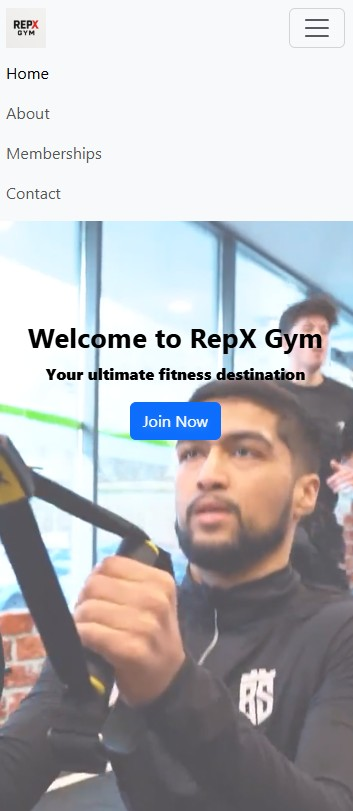  

### Tablet View  
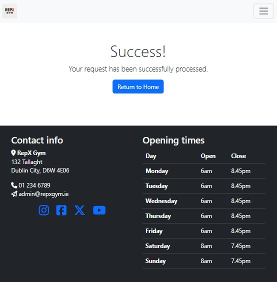  

### Desktop View  
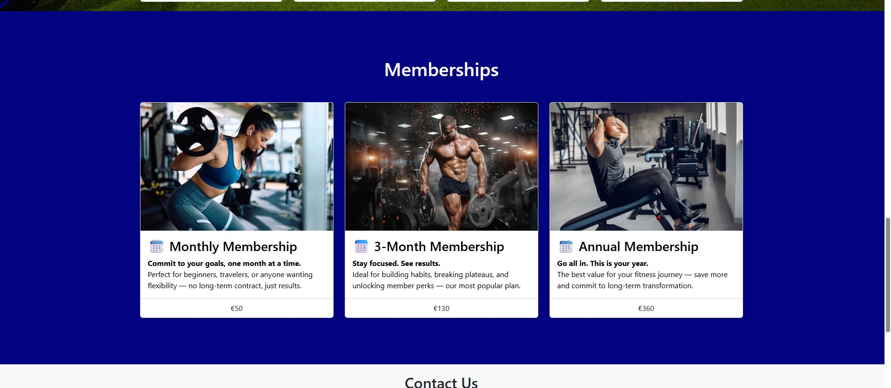  

---

## Features  

### Logo & Branding  
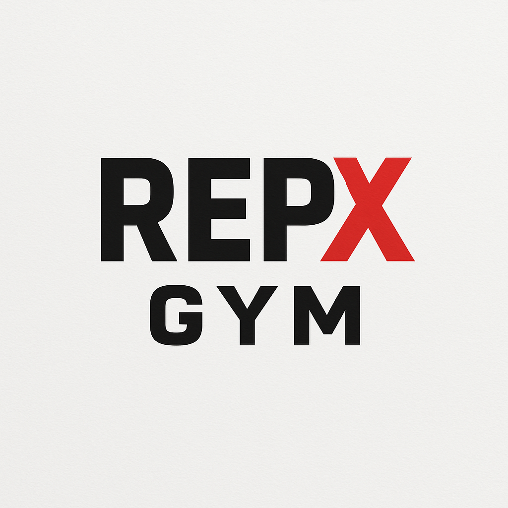  
- Strong, bold branding with a red **X** symbolizing strength and power.  

### Membership Options  
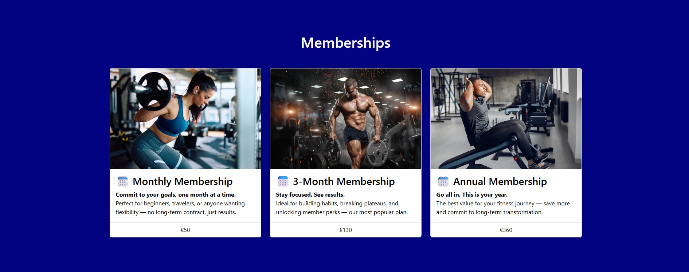  
- Three tiers: **Monthly (€50)**, **3-Month (€130)**, and **Annual (€360)**.  

### Equipment Showcase  
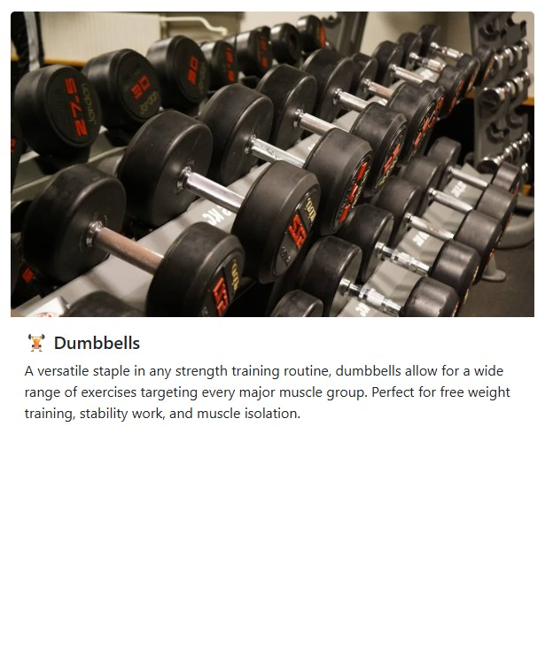  
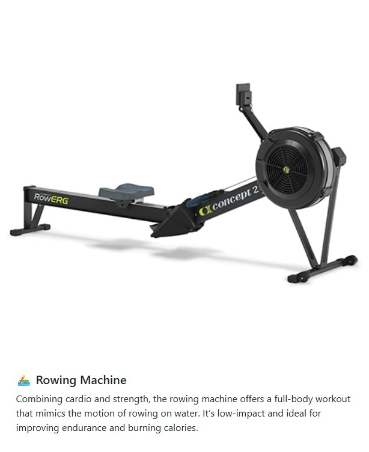  
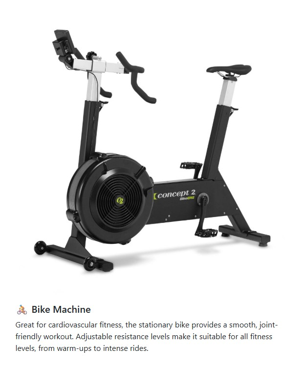  
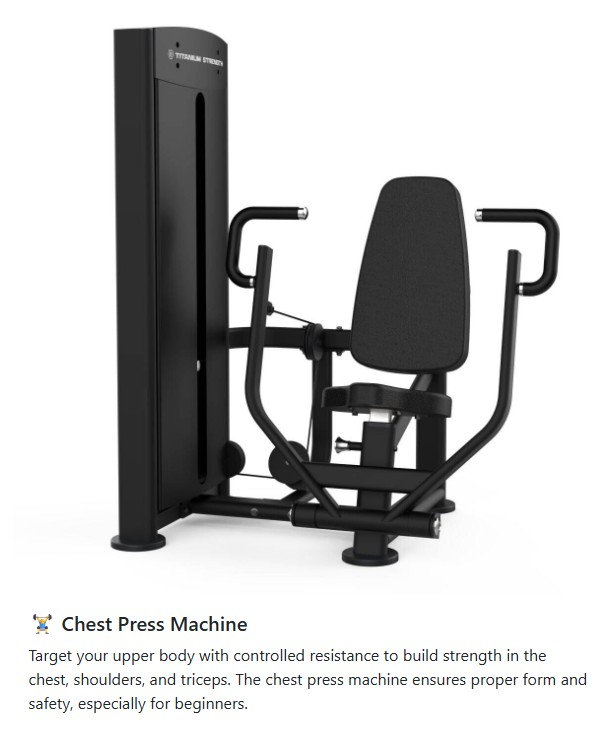
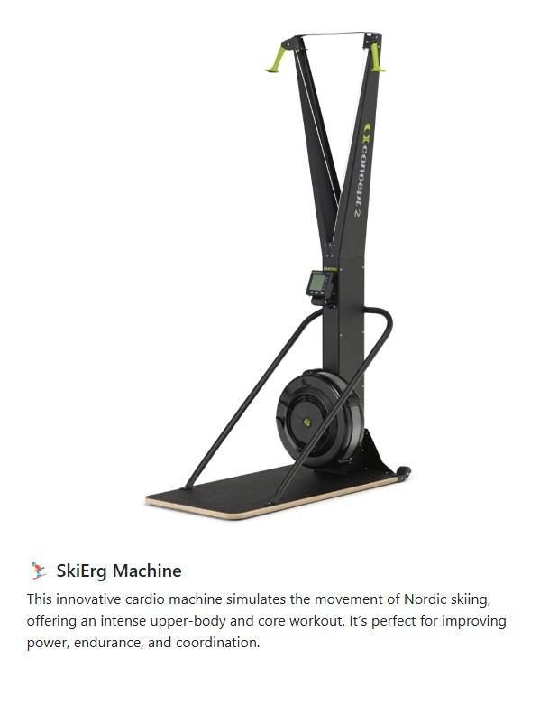  
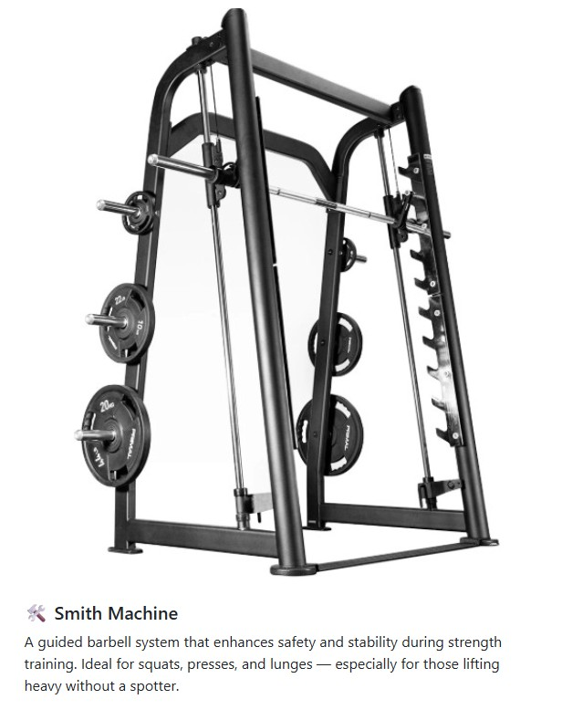  
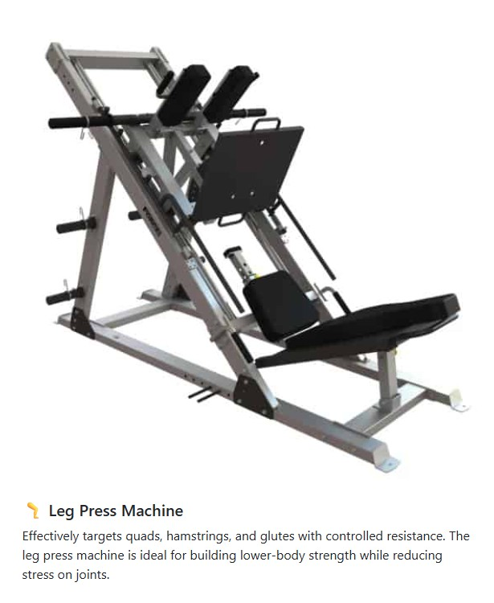  
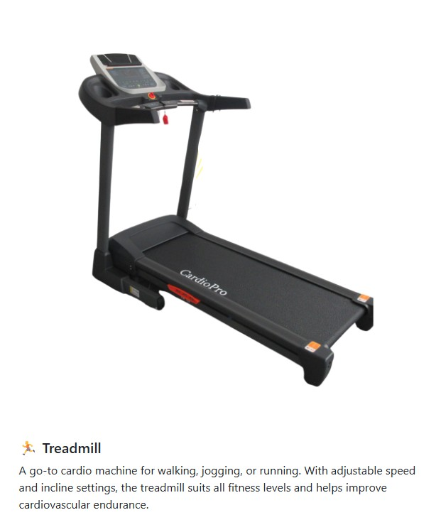  
- Responsive cards displaying gym machines with descriptions: Dumbbells, Rowing Machine, Bike, Chest Press, SkiErg, Smith Machine, Leg Press, Treadmill.  

### Contact & Opening Times  
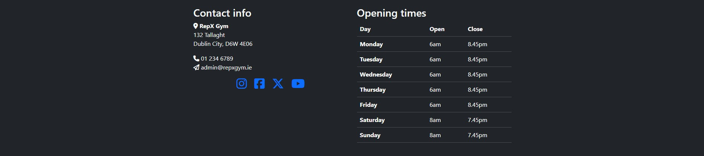  
- Location, email, phone number, and social links.  
- Weekly opening hours clearly displayed.  

### Responsive Navigation  
  
- Collapsible burger menu on smaller screens.  

### Success Page  
  
- Confirmation of successful form submission.  

### 404 Page  
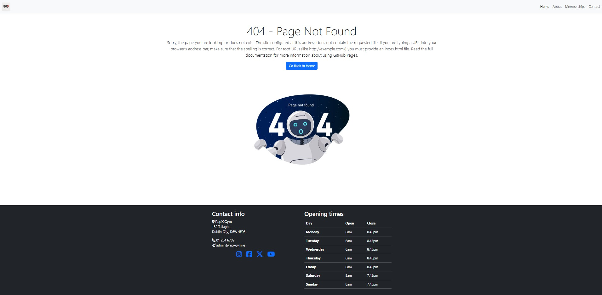  
- Custom error page with navigation back to site. 

- ### Title & Hero Image
  - The title for the homepage floats above the hero image and scrolls with the page. The image used is a classic boardgame which is eyecatching and instantly recognisable. When the upcoming page is being viewed on tablet size and above, the title remains in place while the content scrolls next to it.

         

- ### Navigation Bar
  - The navigation bar appears differently depending on whether the user is on a hand held mobile device such as phones and tablets, or using larger devices such as Laptops and Desktops.
  - Hand held devices have the navigation bar at the bottom with a burger menu to access the links. This is for easier one handed accessibility. 
  
    
  
  - Larger devices have the navigation bar at the top of the page and the links are expanded so in view all the time.

    

- ### Club details section
  - This section tells the user the important information about the club including links to the appropriate sections of the site for more details on location, upcoming events and how to sign up to the newsletter.

    

- ### Map integration
  - The embedded Google map shows the location of where the club meets. This is for potential new members so they can see exactly where to find the club.
  - The link to open the larger map opens in a separate tab.

    

- ### Footer
  - The footer has the links to the clubs social media. This encourages the user to conmect via social media.
  - Links open in a separate tab.

    

- ### Upcoming Events page
  - This section of the site gives both current members and potential new members all the info they need on what's happening in upcoming meets.
  - This gives them the ability to plan whether they want to attend certain dates or not.

    

- ### Newsletter page
  - This page gives the user the option to sign up to an email newsletter that would send out info about the club.
  - This might include highlights of the last meet, details on the next few meets and any other interesting news.

    

- ### Newsletter confirmation page
  - This page confirms that the form submission has been successful and that they are signed up to receive the newsletter.

    

- ### 404 Error page
  - This page shows up when there has been a 404 error. It gives the user options to navigate to other pages of the site.

    

### Future Features

  - I would like to add a feature on the pages that the floating title scrolls. When the title scrolls out of view I'd like to change it to a static bar at the top similar to the navbar when it is at the top.
  - A forum page would also be good for members as they can discuss future meets, ideas about the club and connect.
  - It would be good for the data in the newsletter submission to actually be sent to the author of the website so that a newsletter can be sent.

## Tools & Technologies Used

-  used to generate README and TESTING templates.
-  used for version control. (`git add`, `git commit`, `git push`)
-  used for secure online code storage.
-  used as a cloud-based IDE for development.
-  used for the main site content.
-  used for the main site design and layout.
-  used for hosting the deployed front-end site.
-  used for creating wireframes.
-  used as an interactive map on my site.
-  used for the icons.

## Testing

> [!NOTE]  
> For all testing, please refer to the [TESTING.md](TESTING.md) file.

## Deployment

The site was deployed to GitHub Pages. The steps to deploy are as follows:

- In the [GitHub repository](https://github.com/apeskinian/p1_bgfc), navigate to the Settings tab 
- From the source section drop-down menu, select the **Main** Branch, then click "Save".
- The page will be automatically refreshed with a detailed ribbon display to indicate the successful deployment.

The live link can be found [here](https://apeskinian.github.io/p1_bgfc)

### Local Deployment

This project can be cloned or forked in order to make a local copy on your own system.

#### Cloning

You can clone the repository by following these steps:

1. Go to the [GitHub repository](https://github.com/apeskinian/p1_bgfc) 
2. Locate the Code button above the list of files and click it 
3. Select if you prefer to clone using HTTPS, SSH, or GitHub CLI and click the copy button to copy the URL to your clipboard
4. Open Git Bash or Terminal
5. Change the current working directory to the one where you want the cloned directory
6. In your IDE Terminal, type the following command to clone my repository:
	- `git clone https://github.com/apeskinian/p1_bgfc.git`
7. Press Enter to create your local clone.

Alternatively, if using Gitpod, you can click below to create your own workspace using this repository.

Please note that in order to directly open the project in Gitpod, you need to have the browser extension installed.
A tutorial on how to do that can be found [here](https://www.gitpod.io/docs/configure/user-settings/browser-extension).

#### Forking

By forking the GitHub Repository, we make a copy of the original repository on our GitHub account to view and/or make changes without affecting the original owner's repository.
You can fork this repository by using the following steps:

1. Log in to GitHub and locate the [GitHub Repository](https://github.com/apeskinian/p1_bgfc)
2. At the top of the Repository (not top of page) just above the "Settings" Button on the menu, locate the "Fork" Button.
3. Once clicked, you should now have a copy of the original repository in your own GitHub account!

### Local VS Deployment

There are no differences between the local and deployed version of the site.

## Credits

### Content

| Source | Location | Notes |
| --- | --- | --- |
| [Markdown Builder](https://tim.2bn.dev/markdown-builder) | README and TESTING | tool to help generate the Markdown files |
| [A Complete Guide to Flexbox](https://css-tricks.com/snippets/css/a-guide-to-flexbox/) | Entire Site | Using flexbox
| [W3Schools](https://www.w3schools.com/css/css_positioning.asp) | Entire Site | CSS position Property |
| [ChatGPT](https://openai.com/) | 404 Error Page | Witty 404 error message |

### Media

| Source | Location | Type | Notes |
| --- | --- | --- | --- |
| [favicon.io](https://favicon.io/emoji-favicons/game-die) | Entire site | Image | Favicon on all pages |
| [Pexels](https://www.pexels.com/photo/close-up-photo-of-monopoly-board-game-776654/) | Home Page | Image | Hero image |
| [Pexels](https://www.pexels.com/photo/three-teal-yellow-and-red-pens-776657/) | Upcoming Page | Image | Background image |
| [Pexels](https://www.pexels.com/photo/five-assorted-color-chess-pieces-776655/) | Newsletter Page | Image | Background image |
| [Pexels](https://www.pexels.com/photo/person-in-black-shirt-and-black-pants-sitting-on-brown-and-blue-rug-4691555/) | Newsletter Confirmation Page | Image | Background image |
| [Pexels](https://www.pexels.com/photo/dice-numbers-on-wooden-board-27219380/) | 404 Error Page | Image | Background image |
| [TinyPNG](https://tinypng.com) | Entire site | Image | Tool for image compression |

### Acknowledgements

- I would like to thank my Code Institute mentor, [Tim Nelson](https://github.com/TravelTimN) for his support throughout the development of this project.
- I would like to thank the [Code Institute](https://codeinstitute.net) tutor team for their assistance with troubleshooting and debugging some project issues.
- I would like to thank the [Code Institute Slack community](https://code-institute-room.slack.com) for the moral support; it kept me going during periods of self doubt and imposter syndrome.
- I would like to thank my daughter Niamh, my sister Natalie and my whole family for believing in me, and supporting me while making this transition into software development.