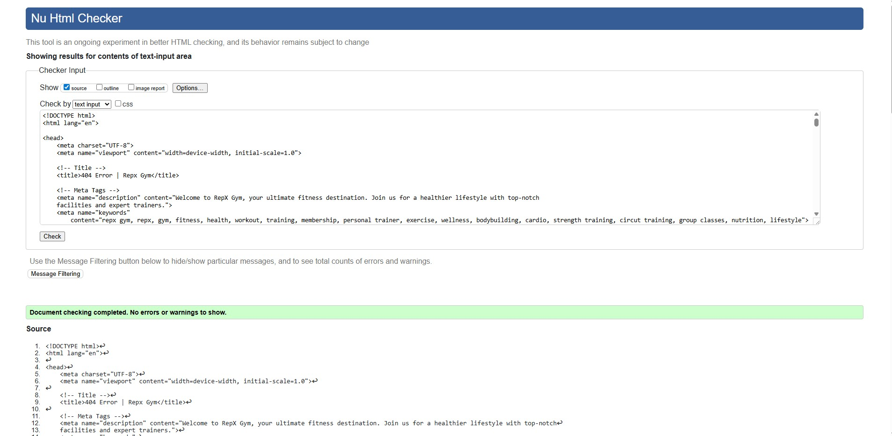
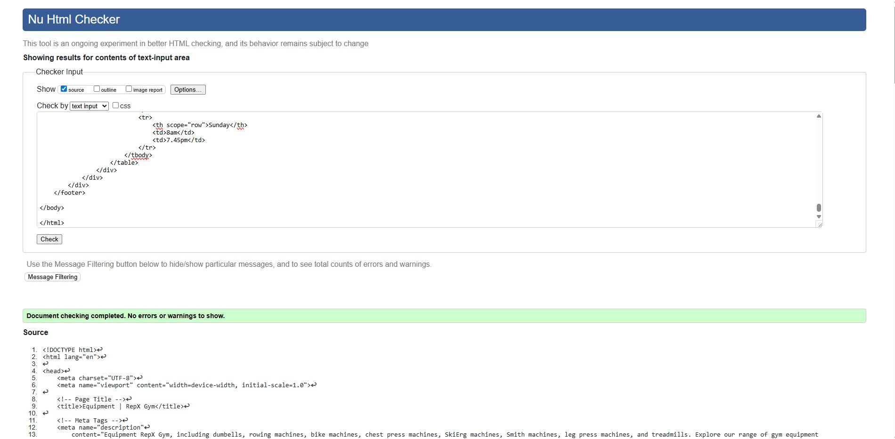
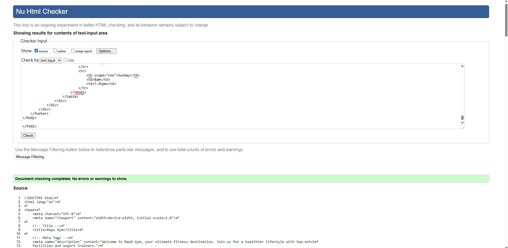
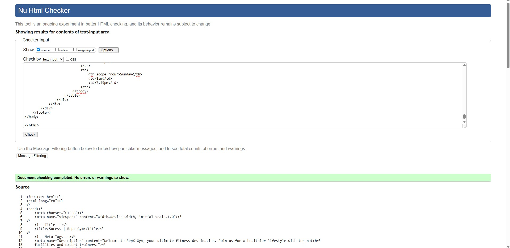
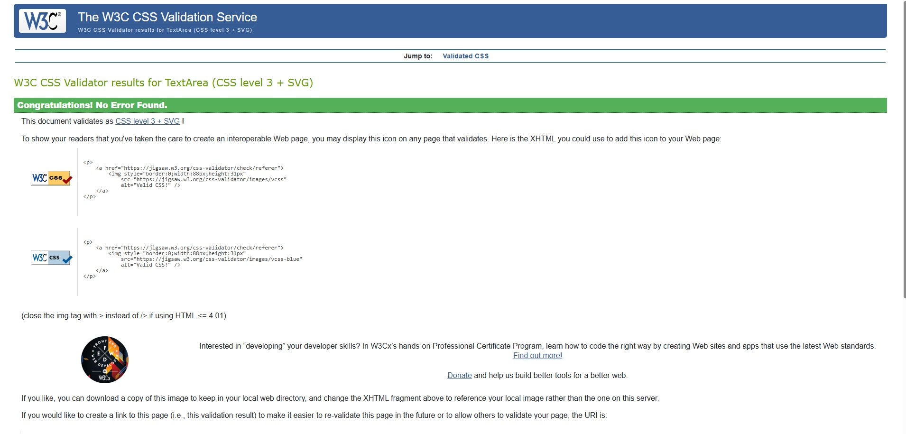
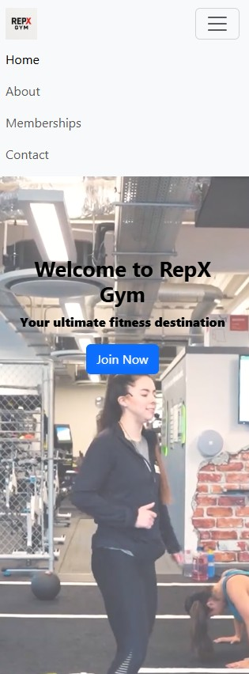
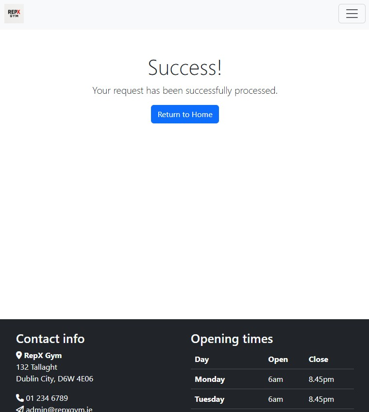
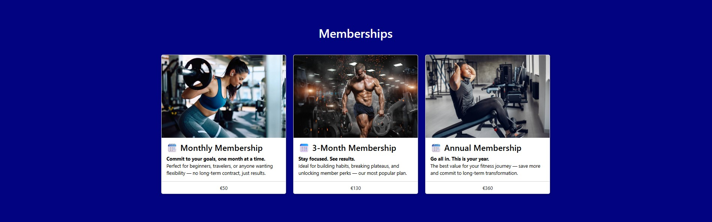

# Testing – RepX Gym

This document outlines the testing carried out for the **RepX Gym** website to ensure functionality, responsiveness, and accessibility.

---

## Code Validation

### HTML Validation
- All pages were run through the [W3C Markup Validator](https://validator.w3.org/).
- **Result:** Document checking completed. No errors or warnings to show.

  
  

### CSS Validation
- Stylesheets were tested with the [W3C CSS Validator](https://jigsaw.w3.org/css-validator/).
- **Result:** No errors found.
  

## Accessibility Testing

- The site was tested using [WAVE Web Accessibility Tool](https://wave.webaim.org/).
- All content is accessible with proper semantic HTML, form labels, and alt attributes.
- Colour contrast passes WCAG AA standards (dark blue background with white text).

## Responsiveness

- Tested using Chrome DevTools across breakpoints:
  - Mobile (iPhone SE, Pixel 5)
  - Tablet (iPad, Samsung Galaxy Tab)
  - Desktop (1920x1080, 1440x900)
- Layout adapts using **Bootstrap’s grid system**.
- Navigation bar collapses to burger menu on smaller screens.

### Screenshots
| Device | Screenshot |
|--------|------------|
| Mobile Navigation |  |
| Tablet Success Page |  |
| Desktop Memberships |  |